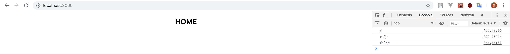
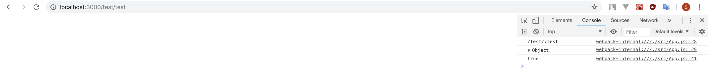
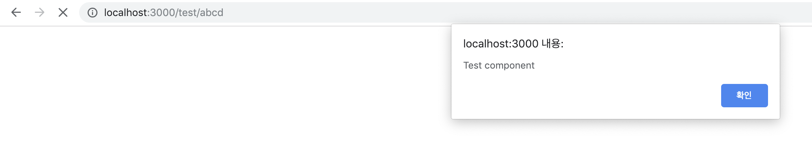
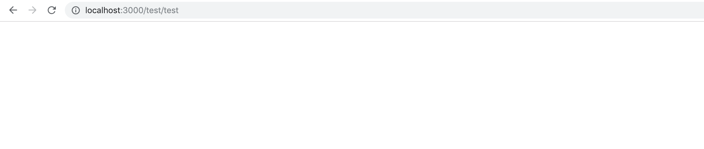
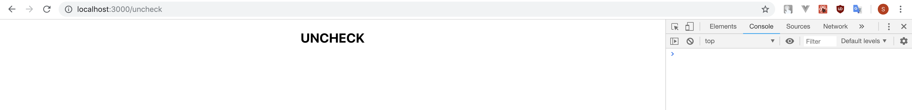

# This is a sample project for [react-navigation-guard module](https://github.com/ninanung/react-navigation-guard)  

## How to test  
```
git clone github.com/ninanung/react-navigation-guard-sample.git
cd react-navigation-guard-sample
npm install
npm start
```  

## Result  
As you can see in the `src/App.js` file. I write all the functions to do `console.log(something)`. If url parameter `test`'s value is also `"test"`, return true and if not, return false. So, in the `Home` component (first image), you can see "false" log.  
  
If you move to `localhost:3000/test/test`, the `Test` component , you can see "true" log.  
  
Hmm, why `Test` component didn't show text? Because, i'm using `blockRender()` function to block rendering. If you see the `App.js` file, i made all component `alert` when it rendered. But only when `returnBool` return true, it will not render the component. Let's see how it goes.  
  
Ok, if you move to `localhost:3000/test/abcd`, it shows you the alert. Cause `returnBool` return false. But, how about `localhost:3000/test/test` ?  
  
Yes, it shows nothing. `blockRender()` function is used and component is not rendered.  
  
Last, you can use `Route` instead of `NavigationGuard` if you don't want to check some component. In the `App.js` file, `Uncheck` component is called by `Route` and show nothing in console.  

## You can use...  

This is just sample code. You can make your own `returnBool`, `ifTrue` and `ifFalse` functions for parammeter checking, url checking, complaring parameter values, path checking and so on. I hope you can use this usefully.  