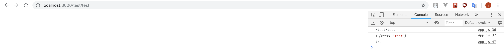

# This is a sample project for [react-navigation-guard module](https://github.com/ninanung/react-navigation-guard)  

## How to test  
```
git clone github.com/ninanung/react-navigation-guard-sample.git
cd react-navigation-guard-sample
npm install
npm start
```  

## Result  
As you can see in the `src/App.js` file. I code all the functions to do `console.log(something)`. If url parameter has `test` value, return true and if not, return false. So, in the `Home` component(first image), you can see "false" log.  
  
If you move to `localhost:3000/test/:test`, the `Test` component , you can see "true" log.  
  

## You can use...  

This is just sample code. You can make your own `returnBool`, `ifTrue` and `ifFalse` functions for parammeter checking, url checking, complaring parameter values, path checking and so on. I hope you can use this usefully.  